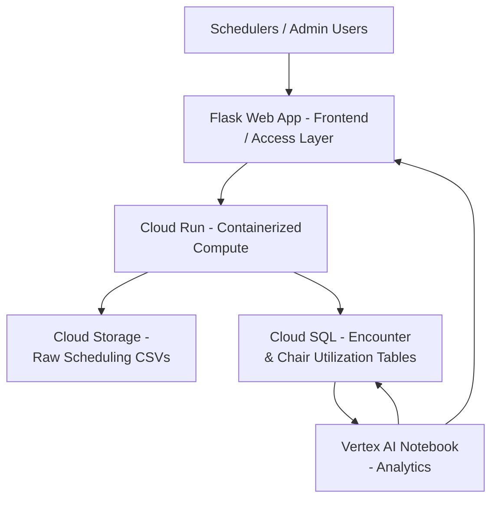

# Architecture & Implementation Plan

## <ins>High-Level Architecture Diagram</ins>

## <ins>Overview</ins>

This architecture supports a cloud-based chemo scheduling and chair utilization support system designed to address operational challenges in an oncology infusion center. The solution integrates cloud storage, compute, databases, and analytics services to improve visibility into nurse capacity constraints and inaccuracies in chemotherapy chair-time estimates. The system is designed for educational purposes and does not contain any real personal information.

---

## <ins>Service Mapping</ins>

| Layer | Service (GCP) | Role in Solution | Related Course Module / Assignment |
|------|---------------|------------------|------------------------------------|
| Frontend / Access | Flask Web App | Allows schedulers to upload scheduling data and view summary metrics | Assignment 2: VMs and Networking with Flask |
| Compute (Container) | Cloud Run | Runs the containerized Flask application and data processing logic | Assignment 3: Serverless |
| Storage | Cloud Storage | Stores raw CSV files containing chemo scheduling and chair-time data | Assignment 1: Intro to Cloud GCP and OCI |
| Database (SQL) | Cloud SQL (MySQL) | Stores cleaned encounter-level scheduling data and utilization tables | Assignment 4: Managed versus Manual Deployment of MySQL |
| Analytics | Vertex AI Notebook | Performs chair utilization analysis and summary reporting | Azure Fundamentals: Describe Azure Architecture and Services |

> [!NOTE]
> While this project is implemented using GCP services, a similar solution could be built on Azure using comparable services such as Azure App Service or Container Apps, Azure Blob Storage, Azure SQL Database, and Azure ML Notebooks.

---

## <ins>Data Flow Narrative</ins>

1. A scheduler or administrator uses the Flask web app to upload new CSV files with chemotherapy schedules, actual chair-time data, and nurse staffing levels.
2. The uploaded files are stored in Cloud Storage as raw data, making it easy to trace and audit changes.
3. A containerized service on Cloud Run checks the files for errors, validates their format, and compares the scheduled chair time with actual usage.
4. After cleaning and transforming the data, it is loaded into Cloud SQL tables for structured querying and reporting.
5. A Vertex AI Notebook securely connects to the SQL database to compute summary metrics, such as average chair-time variance, utilization percentages, and days at risk of overbooking.
6. The collected results are either written back to the database or exposed through the Flask application for display in simple tables or charts.

This process shows a full cloud pipeline, covering everything from data collection to analytics and visualization.

---

## <ins>Security, Identity, and Governance Considerations</ins>

Security in this project is managed using built-in cloud identity and access controls. Usernames and passwords are not stored in the application. Instead, cloud service accounts enable components such as Cloud Run and analytics notebooks to securely access Cloud Storage and Cloud SQL. Sensitive configuration details, such as database connection information, are managed via environment variables rather than hardcoding.

The system uses role-based permissions, so only approved users or services can upload scheduling data or see analytical results. To prevent compliance or privacy issues, the project data does not include any real personal information and is used only for educational purposes. This method follows standard healthcare best practices for building or testing systems outside of production.

---

## <ins>Cost and Operational Considerations</ins>

To keep costs low and fit the project’s needs, the design uses serverless and managed cloud services. Cloud Run scales up or down based on use, so you only pay when the app runs. Cloud Storage remains inexpensive because the scheduling files are small, and Cloud SQL can run on a minimal setup for demos.

Analytics notebooks start only when analysis is needed and can be shut down when not in use, which helps avoid unnecessary costs. By avoiding always-on virtual machines, this design minimizes operational overhead while still demonstrating realistic cloud deployment patterns used in healthcare organizations.

