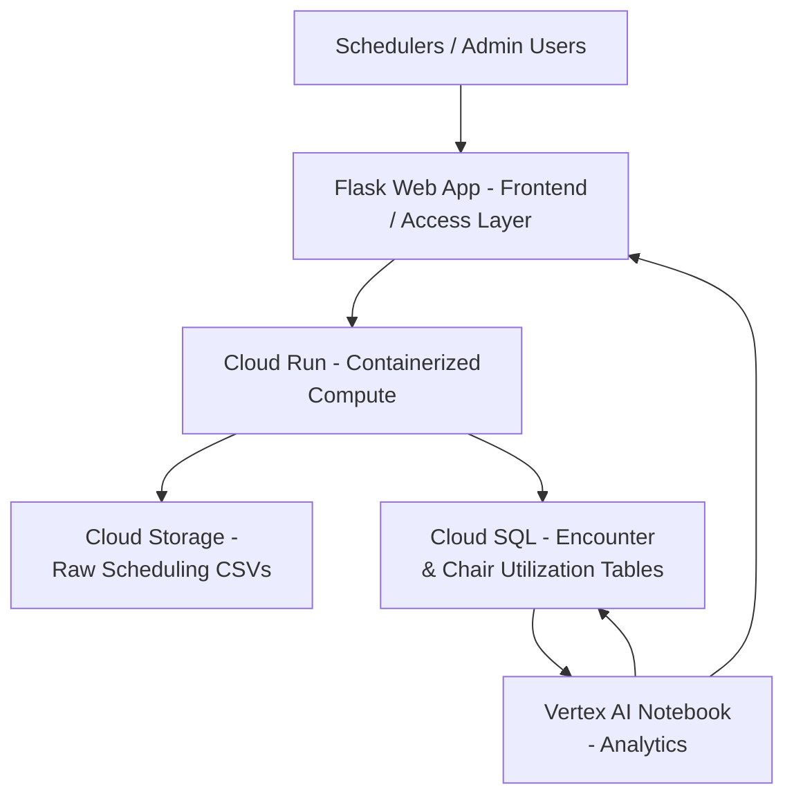

# Architecture & Implementation Plan

## <ins>High-Level Architecture Diagram</ins>

## <ins>Overview</ins>

This architecture supports a cloud-based chemo scheduling and chair utilization support system designed to address operational challenges in an oncology infusion center. The solution integrates cloud storage, compute, databases, and analytics services to improve visibility into nurse capacity constraints and inaccuracies in chemotherapy chair-time estimates. The system is designed for educational purposes and does not contain any real personal information.

---

## <ins>Service Mapping</ins>

| Layer | Service (GCP) | Role in Solution | Related Course Module / Assignment |
|------|---------------|------------------|------------------------------------|
| Frontend / Access | Flask Web App | Allows schedulers to upload scheduling data and view summary metrics | Assignment 2: VMs and Networking with Flask |
| Compute (Container) | Cloud Run | Runs the containerized Flask application and data processing logic | Assignment 3: Serverless |
| Storage | Cloud Storage | Stores raw CSV files containing chemo scheduling and chair-time data | Assignment 1: Intro to Cloud GCP and OCI |
| Database (SQL) | Cloud SQL (MySQL) | Stores cleaned encounter-level scheduling data and utilization tables | Assignment 4: Managed versus Manual Deployment of MySQL |
| Analytics | Vertex AI Notebook | Performs chair utilization analysis and summary reporting | Azure Fundamentals: Describe Azure Architecture and Services |

> [!NOTE]
> An equivalent Azure implementation could use Azure App Service or Container Apps, Azure Blob Storage, Azure SQL Database, and Azure ML Notebooks.*

---

## Data Flow Narrative

1. A scheduler or administrator accesses the Flask web application to upload updated CSV files containing chemotherapy schedules, actual chair-time data, and nurse staffing capacity.
2. Uploaded files are saved to Cloud Storage as raw source data for traceability and auditing.
3. A containerized service running on Cloud Run validates the files, checks for formatting issues, and calculates differences between scheduled and actual chair time.
4. Cleaned and transformed data is loaded into Cloud SQL tables for structured querying and reporting.
5. A Vertex AI Notebook connects securely to the SQL database to compute summary metrics, such as average chair-time variance, utilization percentages, and days at risk for overbooking.
6. Aggregated results are either written back to the database or exposed through the Flask application for display in simple tables or charts.

This flow demonstrates a complete, end-to-end cloud pipeline from data ingestion to analytics and visualization.

---

## Security, Identity, and Governance Considerations

Security is addressed at a high level using cloud-native identity and access management. Service accounts are used to allow Cloud Run and analytics notebooks to access Cloud Storage and Cloud SQL without hard-coded credentials. Sensitive configuration values, such as database connection strings, are stored as environment variables.

Access is restricted using role-based access control (RBAC), ensuring that only authorized users or services can upload data or view analytics. To avoid compliance risks, all data used in this project is synthetic or de-identified, and no real patient identifiers or protected health information (PHI) are included. This design reflects best practices for healthcare data governance in non-production environments.

---

## Cost and Operational Considerations

To keep costs low and suitable for a student or free-tier environment, the solution relies on serverless and managed services where possible. Cloud Run scales automatically and only incurs costs when the application is actively used. Cloud Storage costs are minimal due to the small size of CSV files, and Cloud SQL can be configured using a basic instance for demonstration purposes.

Analytics notebooks are started only when needed and shut down when idle to avoid unnecessary charges. This architecture avoids always-on virtual machines, reducing operational overhead while still demonstrating realistic cloud integration patterns used in healthcare organizations.

